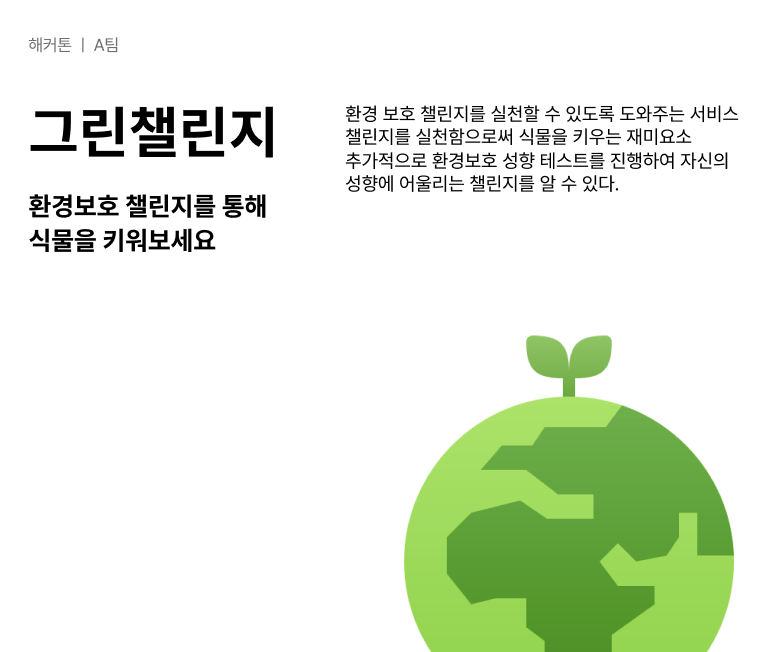

# WIT 연합 동아리 내에서 진행된 해커톤!!(2022/07/22~23)
## A팀
- 기획: 강상우
- 디자인: 윤다인
- 프론트: 김현아(코틀린 안드로이드)
- 백엔드: 강지민(자바 스프링부트, 스프링 데이터 JPA)

------------
## 서비스 소개

------------
## 이슈
### 컴퓨터 2대로 개발을 진행하는 상황(프론트 1대, 백엔드 1대)인데 api통신을 어떻게 해야하는가..?
프론트분이 앱 개발만 가능하다고 하셔서 프론트는 코틀린 안드로이드, 백엔드는 내 주력인 자바 스프링으로 환경세팅을 하던 중이였다. 하지만 여기서 문제 프론트분이 백엔드와의 HTTP 통신 라이브러리를 모르신다는 점이였다. 어... 솔직히 굉장히 당황했다. 우리 팀 4명 중 가장 프로젝트에 대한 경험이 있으셨고 해서 백엔드와의 협업에서 빠질 수 없는 부분인데 이걸 모르면 어떻게 그동안 해오신거지..?라는 생각이 들었다. 그나마 불행 중 다행이었던 건 HTTP 응답 메소드: GET POST 등은 알고 계셔서 아 그러면 기획분들 회의끝나기 전에 서로 통신하는 예제를 만들어보자!해서 서로 각자 만들어본 후 각자 컴퓨터에서 실행을 해 보았는데... 당연히 안 될게 뻔했다. 로컬에서 각자 돌렸는데 될리가... ㅋㅋㅋ 뭔가 두 컴퓨터가 같은 와이파이를 사용해서 IP를 맞춰서 뭐 어떻게 하면 될 것 같은데?라는 생각에 구글링을 했는데 만족스러운 결과를 찾지 못했고 게더타운에 계신 동아리장님의 조언을 빌려 그냥 aws에서 서로 통신할 수 있는 ec2 서버를 띄우라고 하셔서 그렇게 내 계획의 1번인 erd는 쳐다보지도 못한채 서버를... 만들기 시작했다. 처음 만들어보는 ec2 인스턴스였기에 굉장히 오랜시간이 걸렸다. 아마 기억에 해커톤 시간 중에 가장 많은 시간(6시간 정도..?)을 투자했던 것 같다. 우여곡절 끝에 만들어서 서로 통신해보았는데 통신에는 성공했지만, 매핑된 값이 없다는 404에러를 자꾸 반환해서 결국 프론트는 프론트대로 코드를 짜고, 백엔드는 통신이 가능했을 때를 생각해서 erd 및 api 명세서를 짜고 백엔드 코드를 짜기로 하였다. ㅠㅠ 내 6시간 ㅠㅠ
+ **정리**
  + 와이파이의 설정을 조금 바꾸어서 통신을 가능하게 해보자! -> 실패
  + aws ec2 서버를 띄워 프론트와의 통신을 가능하게 해보자! -> 통신에는 성공했지만 404에러 반환
  + 나중에 개발셀장님한테 물어보니 백엔드 컴퓨터의 개인 방화벽에서 공유하고 싶은 포트를 열어놓으면 프론트에서 와이파이의 IP주소에 만든 API를 전송하면 ec2가 아니고도 통신가능하다고 한다! -> 실험해 볼 프론트 노트북이 없음(보류)
  + https://ansan-survivor.tistory.com/408

### 처음 짜 보는 ERD와 API 문서
전혀 막힘이 없을 것이라 생각했는데, 매주 나오는 동아리 과제와 그동안의 쫌쫌따리 개발 경험에서 erd랑 api 문서쯤이야 하고 후딱 끝내야지 했었는데 ㅋㅋㅋㅋㅋㅋ 무슨 개털렸다. 그저 IA를 보고 테이블을 구상해보았는데 음... 쉽지 않았다. 밑에 해커톤 끝나고 수정한 것도 올릴테지만 초안은 이렇다.

+ **정리**
  + 연관관계를 생각하며 ERD를 짜보자! -> 정신적으로 지친 상태에서 짠 상태라 결점이 많음(불필요한 테이블이 있음... 등)
  + 프론트에 전달해줄 데이터를 생각하며 API 문서를 짜보자! -> 불필요한 URI, 쿼리파라미터들이 있음

  
### 팀원 모두 각자의 역할에 경험 부족
사실 누구의 탓이라고 할 게 없다. 모두 경험 부족이었던 것 같다. 음 다들 끝나고 본인 한 것들에 대해 정리했을지는 모르겠지만 내 개인적으로 생각한 모두의 아쉬웠던 점이라고 하면은... 기획과 디자인단에서는 개발에 대한 지식이 거의 없으시다 보니 핵심 기능이 만들어지지도 않았는데 계속 기능이 추가되는 등 개발 볼륨 설정에 대한 미스(사실 14시간은 해커톤 치고 매우 짧은 시간이다.)가 있었고 프론트단에서는 위에서 말했듯이 백엔드와의 통신 방법을 모르셨고, 나는 ERD와 API 설계에 대한 미숙함이 있었다. 이게 모두가 미숙해서 다행이었지, 실력있는 사람들만 모이는 해커톤에서 ERD랑 API 짜는데 이리 오랜 시간이 걸렸다면 굉장히 민폐였을 것이다.

무엇보다 해커톤이 8시간이 지나고쯤인가 모두 본인할 것에 지쳐 커뮤니케이션이 더 원활하게 이루어지지 않은 것이 아쉽기도 하다. 또한 모든 과정이 단계별로 딱딱 끊어서 진행되지 않고 어떤 것이 진행되던 도중 다음 단계의 것이 진행되는 등 단계별로 진행된다는 느낌이 들지 못했다.

그래도 기획안 자체는 나쁘지 않았다. 무엇보다 아쉬운 것은 개발 상황이 많이 진행되지 못한 점 ㅠㅠ 프론트는 기획했던 환경 보호 테스트와 챌린지 중 테스트만 구현이 완료되었고 백엔드는 챌린지의 회원가입 없이 식물 분양받기 까지만 코드가 구현된 상태였다. 종합 완성본을 보면

이러하다... 환경 보호 테스트에선 백엔드의 영역이 필요하지 않아 환경 보호 챌린지 API를 구현하고 있었는데 시간 부족으로 챌린지에서 식물 분양 받는 코드까지 구현했다 ㅠㅠ

도중도중 동아리 운영진분들께서 미니게임 같은 것도 준비해주시고 해커톤 도중 루즈해지게 않게 하기 위해 노력을 많이해주셨다 ㅎㅎ 발표까지 다 들었는데 다른 팀들은 확실히 프론트가 2명에다 경험자들이 조금 많으셔서 모두 개발이 완료된 상태였다. ㅠㅠ 하지만 기획만 따지고 보면 개발은 완료되지 못했지만 절대 밀리지 않는다고 생각했다. 결과는 결국 3팀 중 3등 ㅠㅠ 개발을 끝마치지 못한것이 큰 것 같았다 ㅠㅠ 순간 화가 났지만 억울해서라도 집에 와서 기능을 다 만드리라고 다짐했다. 그리고 기능을 다 구현하고 업데이트 중이다 ㅎㅎ

추가된 기능은

1. 회원가입, 로그인
2. 식물 분양받기
3. 분양된 식물을 가지고 챌린지를 진행하여 경험치 추가되는 기능

이에 따라 변경된 ERD와 API 문서이다.

추가되고 변경된 핵심적인 기능이라 하면은 기존에는 회원가입 없이 아무나 챌린지에 참여 가능했는데, 회원가입 및 로그인 기능을 구현하여 1인당 하나의 식물을 분양받을 수 있도록 하였다. 또한 프론트에서 요청을 하면 식물의 경험치가 추가될 수 있도록 하였다.